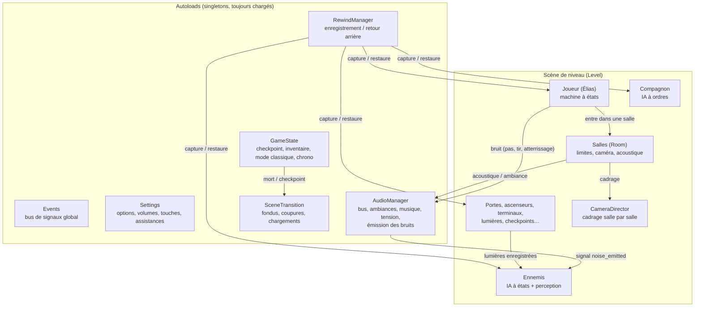
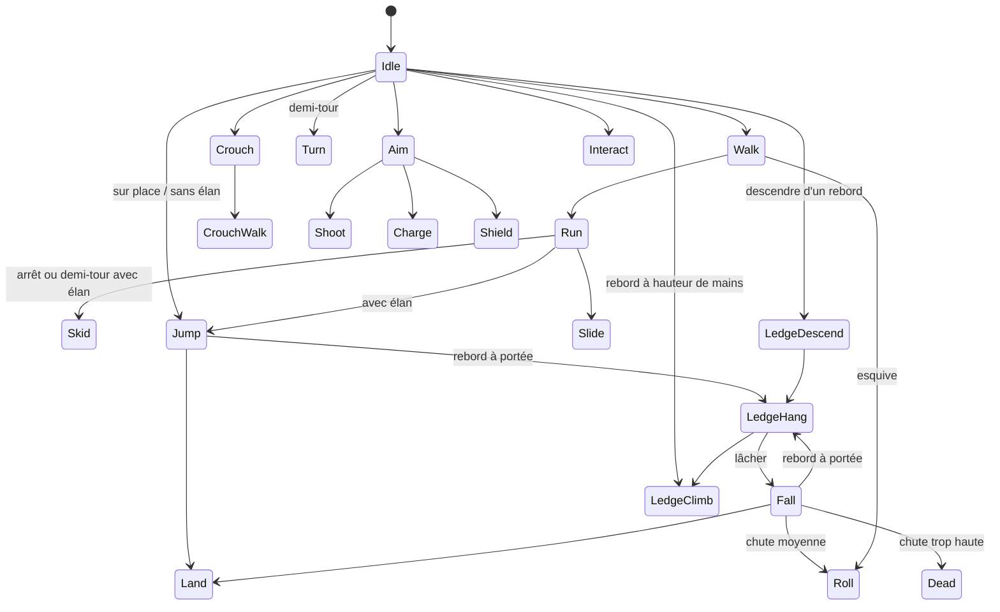
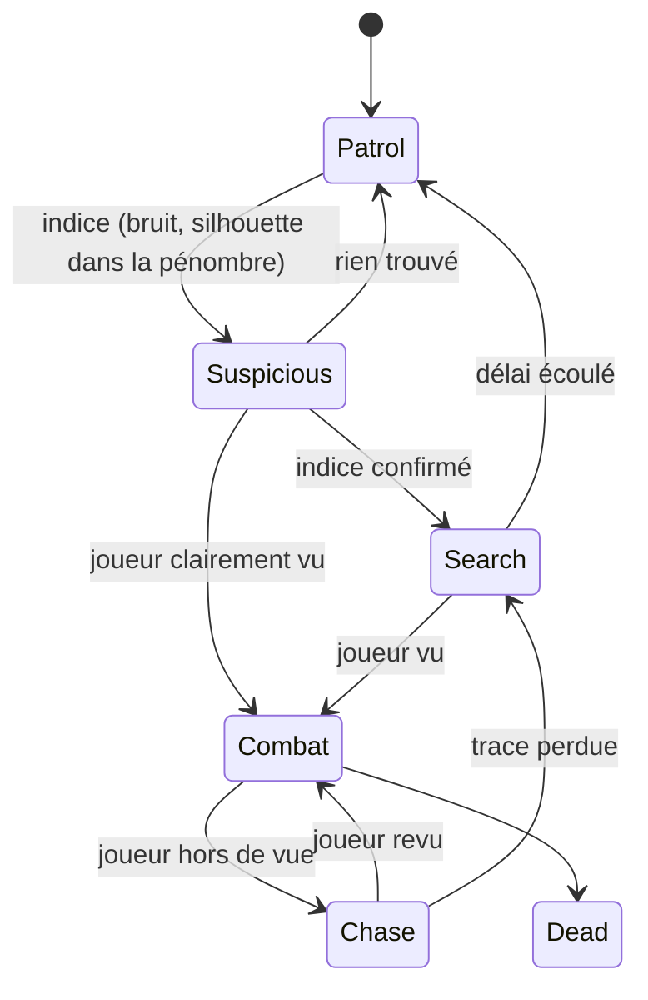
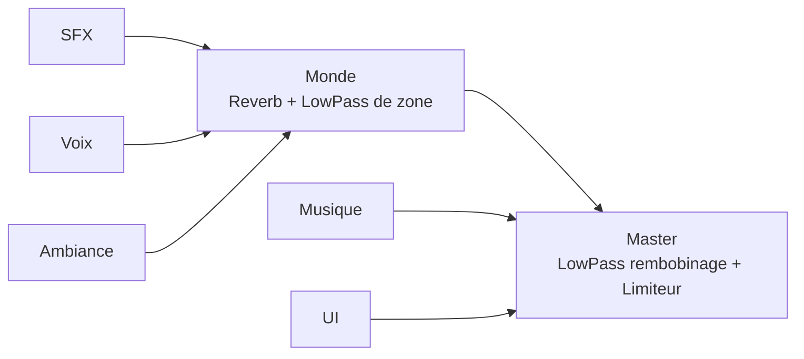

# PARADOXE — Plan de développement du prototype

> Document de référence du prototype (« vertical slice »).
> Il décrit **quoi** construire, **comment** l'organiser et **dans quel ordre**.
> Il évoluera : chaque écart important sera noté dans `docs/JOURNAL.md`.

---

## 1. Résumé

PARADOXE est un jeu de plateforme cinématique 2D en vue de profil, écran par écran,
dans l'esprit d'*Another World* et de *Flashback* (mouvements « engagés », mort en un
coup, narration sans texte), modernisé par huit évolutions (parkour, rembobinage,
compagnon, infiltration lumière/son, énergie unifiée, transitions cinématiques,
interface diégétique, accessibilité/chrono).

Le prototype compte **8 écrans** (intro comprise), jouables **dans un navigateur**
(GitHub Pages) et en **exécutables autonomes** Windows/Linux (GitHub Releases).

**Le son est un pilier** : un seul système joue les sons *et* informe les ennemis de
ce qu'ils entendent. Ce que tu entends est ce que les ennemis entendent.

---

## 2. Choix techniques de base

| Sujet | Choix | Pourquoi |
|---|---|---|
| Moteur | **Godot 4.7.2-stable** (dernière stable, vérifiée le 25/09/2026) | Demandé. Version figée partout (setup.sh, CI, modèles d'export). |
| Langage | **GDScript typé** (`var vitesse: float = 3.0`) | Seul langage fiable à l'export Web. Le typage aide à repérer les erreurs, comme `Option Explicit` en VBA. |
| Rendu | **Compatibility** (OpenGL 3 / WebGL 2) | Seul moteur de rendu disponible sur le Web. On l'utilise partout pour que le rendu soit le même sur toutes les plateformes. |
| Résolution | 1280×720 de base, mise à l'échelle `canvas_items`, ratio conservé | Les polygones restent nets à toutes les tailles. |
| Physique | Moteur 2D intégré, 60 ticks/s | Suffisant pour un jeu de plateforme. |
| Tests | **Lanceur de tests maison** (`tests/run_tests.gd`) | Aucune dépendance externe (GUT dépend de la version de Godot). Un fichier `test_*.gd` = une série de tests. Il s'exécute en headless et renvoie un code d'erreur à la CI. |
| Données de réglage | Fichiers **Resource `.tres`** dans `/resources` | Modifiables dans l'inspecteur de Godot ou à la main, sans toucher au code. |
| Sons | Générés en **Python (numpy/scipy)**, versionnés en WAV | Reproductibles, modifiables, sans problème de droits. |

### Nommage et conventions (résumé, détaillé dans `CLAUDE.md`)
- Noms de variables/fonctions/fichiers **en anglais** (`snake_case`), comme l'API de Godot.
  Ça évite le franglais `get_vitesse()`.
- **Commentaires et documentation en français**, abondants et pédagogiques.
- Règle d'architecture : **« les appels descendent, les signaux remontent »** (un parent
  appelle les fonctions de ses enfants ; un enfant prévient son parent par un signal).
- Aucune valeur de gameplay « en dur » dans le code : tout passe par une Resource.

---

## 3. Architecture générale

### 3.1 Vue d'ensemble



### 3.2 Les autoloads (état global)

Un *autoload* est un script chargé une seule fois au démarrage et accessible partout
par son nom (un peu comme un module VBA public). On en limite le nombre à six :

| Autoload | Rôle |
|---|---|
| `Events` | Bus de signaux globaux (`player_died`, `checkpoint_reached`, `alert_level_changed`…). Évite que les objets se connaissent tous entre eux. |
| `GameState` | État de la partie : checkpoint actif, inventaire, utilisations de rembobinage restantes, mode classique, chrono. |
| `Settings` | Options du joueur, sauvegardées dans `user://settings.cfg` : volumes par bus, touches, assistances, accessibilité. |
| `AudioManager` | Chef d'orchestre sonore (voir §6). Joue les sons **et** diffuse les bruits aux ennemis. |
| `RewindManager` | Enregistre l'état des objets « rembobinables » et le restaure (voir §5.5). |
| `SceneTransition` | Fondus, coupures au noir, changements de scène, déblocage audio Web. |

### 3.3 Monde écran par écran : les salles

Tout le prototype est **une seule scène de niveau** contenant les 8 salles posées côte à
côte dans l'espace, comme une planche de BD. Chaque salle (`Room`) définit :
- ses **limites** (un rectangle de la taille d'un écran, ou plus grand pour les scènes
  spectaculaires) ;
- son **cadrage** : zoom, parallaxe, et éventuellement une caméra qui s'écarte ;
- son **acoustique** : ambiance, réverbération, filtre (voir §6) ;
- son **éclairage ambiant**, utilisé à la fois par le rendu et par la perception ennemie.

Quand Élias franchit la limite d'une salle, le `CameraDirector` fait glisser la caméra
vers la salle suivante (0,45 s, avec un léger décalage des plans de parallaxe), et
l'`AudioManager` bascule en fondu vers la nouvelle acoustique.

Pourquoi une seule scène plutôt qu'une scène par écran ? Avec 8 écrans, tout tient
en mémoire ; les transitions deviennent de simples mouvements de caméra (fluides, sans
temps de chargement), et les ennemis d'un écran voisin peuvent entendre un bruit à
travers une porte. *État en J2 :* les salles de la salle de test sont décrites directement
dans `scenes/levels/test_level.tscn`. Pour le niveau du prototype (J7-J8), chaque salle
pourra devenir une scène séparée (`scenes/rooms/…`) instanciée dans le niveau, afin de les
éditer une par une.

### 3.4 Le personnage : machine à états explicite



- **Un script par état** (`scripts/player/states/run.gd`…), tous héritant d'une classe
  `State` avec trois fonctions : `enter()`, `exit()`, `physics_update(delta)`, plus
  `is_committed()`. La `StateMachine` ne fait qu'appeler l'état courant. Les états ne lisent
  pas le clavier : ils interrogent les intentions du personnage (`PlayerInput`). Les états
  de combat sont arrivés en J3 : Aim (arme levée), Shoot (tir et recul), Charge (tir
  chargé), Shield (bouclier).
- **Mouvements engagés** : chaque état indique s'il est *interruptible*. Un saut, une
  roulade, un hissage vont à leur terme. Les commandes pressées pendant ce temps sont
  **mémorisées** (tampon de 0,2 s) et exécutées à la fin : c'est ce qui donne des
  enchaînements fluides sans rendre le personnage « flottant ».
- **Seule la mort interrompt tout.**
- **Visuel séparé de la logique** : les états ne parlent jamais au dessin directement,
  ils appellent un nœud `CharacterVisual` (`play("run", durée)`, signal
  `anim_event("footstep")`). Les durées viennent des réglages, pas du dessin : le visuel
  adapte la vitesse de l'animation à la durée demandée. Aujourd'hui ce nœud anime une silhouette en
  polygones via un `AnimationPlayer` ; demain il pourra être remplacé par un
  `AnimatedSprite2D` rotoscopé qui respecte la même interface, sans toucher aux états.
- Les sons qui doivent tomber à l'image près (pas, corps qui s'effondre) sont déclenchés
  par des **événements d'animation** (piste d'appel de méthode de l'`AnimationPlayer`) ;
  les actions (saut, réception, prise d'un rebord) par les états eux-mêmes. Les deux
  passent par le même signal `anim_event`.

### 3.5 Données de réglage (Resources)

| Fichier | Contenu (exemples) |
|---|---|
| `resources/player/player_movement.tres` | vitesses marche/course/accroupi, hauteurs et longueurs de saut, hauteur de chute sans dégât / avec roulade / mortelle, tampon d'entrée, portée de rattrapage de rebord |
| `resources/player/energy.tres` | capacité, vitesse de recharge, délai avant recharge, coûts du tir / bouclier (par seconde) / tir chargé |
| `resources/weapons/pistol.tres` | cadence, vitesse du projectile, temps de charge, durée de bouclier |
| `resources/enemies/sentinel.tres` | vitesses, distances de vue, angle de vision, seuil de lumière, sensibilité auditive, durées d'alerte / de recherche, temps de réaction |
| `resources/enemies/sentinel_energy.tres`, `resources/weapons/sentinel_gun.tres` | jauge et arme des Sentinelles (J3) : mêmes réglages qu'Élias, autres valeurs |
| `resources/rewind.tres` | durée enregistrée (5 s), fréquence d'échantillonnage, utilisations par checkpoint (3) |
| `resources/audio/sound_library.tres` | chaque son : fichiers, bus, volume, variation de hauteur, **rayon de bruit perçu par les ennemis** |
| `resources/audio/zones/*.tres` | une zone acoustique : couches d'ambiance, réverbération, filtre |
| `resources/assist.tres` | valeurs par défaut des options d'assistance |

**Grammaire de niveau** (valeurs initiales, toutes dans `player_movement.tres`) :
1 bloc = 48 px ; Élias mesure 2 blocs.
Saut sans élan : 1 bloc de haut, 2 de long. Saut avec élan : 4 blocs de long.
Chute : sans conséquence jusqu'à 3 blocs, roulade obligatoire jusqu'à 5, mortelle au-delà.
Ces règles servent à dessiner les salles de façon cohérente et lisible.

### 3.6 Arborescence

```
/scenes      scènes .tscn (player/, enemies/, props/, rooms/, levels/, ui/, audio/)
/scripts     scripts .gd, même découpage que /scenes + autoload/
/assets      audio/ (sfx/, ambience/, music/), fonts/, shaders/, textures/
/resources   fichiers .tres de réglage
/tests       lanceur maison + test_*.gd + tests de fumée des scènes
/tools       audio/ (générateur Python), scripts de build et de capture d'écran
/docs        PLAN.md, JOURNAL.md, SOUND_DESIGN.md
setup.sh, export_presets.cfg, project.godot, README.md, CLAUDE.md, CREDITS.md
.github/workflows/  CI
```

---

## 4. Liste des scènes

### 4.1 Scènes réutilisables

| Scène | Rôle |
|---|---|
| `player/elias.tscn` | Joueur : corps physique, machine à états, visuel, arme, bracelet, émetteur de bruit |
| `characters/companion.tscn` | Chef de la résistance : IA à ordres (suivre, attendre, activer) |
| `enemies/sentinel.tscn` | Humanoïde armé : IA à états, perception lumière/son, bouclier |
| `enemies/stalker.tscn` | Prédateur de l'écran 2 : IA simple (poursuite scénarisée) |
| `props/door.tscn` | Porte (ouverture par interrupteur, terminal, clé) |
| `props/elevator.tscn` | Ascenseur à étages |
| `props/switch.tscn`, `props/pressure_plate.tscn` | Interrupteur, plaque de pression (énigme à deux) |
| `props/terminal.tscn` | Terminal (ouvre, éteint, affiche une image sans texte) |
| `props/pickup.tscn` | Objet ramassable (clé, pierre à lancer, cellule d'énergie) |
| `props/throwable.tscn` | Objet lancé (bruit à l'impact → diversion) |
| `props/light_source.tscn` | Lumière 2D + valeur de perception + destructible |
| `props/checkpoint.tscn` | Point de sauvegarde (invisible ou balise lumineuse) |
| `props/hazard.tscn` | Zone mortelle (vide, eau profonde, plantes) |
| `audio/sound_zone.tscn` | Zone qui modifie l'ambiance ou l'acoustique localement |
| `audio/sound_emitter_2d.tscn` | Source sonore positionnée (machine, cascade, créature) |
| `rooms/room.tscn` | Gabarit de salle (limites, cadrage, acoustique, lumière ambiante) |
| `fx/*.tscn` | Pluie, brouillard, éclairs, particules de spores, impacts |
| `cutscenes/cutscene_player.tscn` | Lecteur de cinématiques : bandes noires, enchaînement des plans, passer la cinématique (voir §5.12) |
| `ui/bracelet.tscn` | Interface holographique au poignet |
| `ui/ghost.tscn` | Fantôme du mode chrono |

### 4.2 Scènes d'écran (menus et outils)

`ui/title_screen.tscn` (« appuyer sur une touche » → débloque l'audio Web),
`ui/main_menu.tscn`, `ui/pause_menu.tscn`, `ui/options_menu.tscn`
(volumes, touches, mode classique, assistances, accessibilité),
`ui/sound_board.tscn` (banc d'écoute), `ui/credits.tscn`,
`cutscenes/intro.tscn` (cinématique d'ouverture), `cutscenes/capture.tscn`, `cutscenes/meeting.tscn`, `cutscenes/ending.tscn`,
`levels/prototype.tscn` (le niveau complet), `levels/test_level.tscn` (salle de test J2–J3).

*État en J3 :* existent `player/elias.tscn`, `enemies/sentinel.tscn`,
`props/checkpoint.tscn`, `levels/test_level.tscn` et `ui/title_screen.tscn`. Les
projectiles, les boucliers et l'arme n'ont pas de scène : ils sont créés par le code
(`scripts/combat/`), le même pour Élias et les Sentinelles.

### 4.3 Les 8 écrans du prototype

| # | Écran | Ce qui s'y passe | Mécaniques | Son |
|---|---|---|---|---|
| 1 | **Laboratoire, 2140** (cinématique d'intro) | **Cinématique d'ouverture non interactive** (≈ 75 s, voir §5.12) : nuit d'orage, arrivée d'Élias au labo, photo avec son collègue (qui porte un **pendentif en spirale**), lancement de l'expérience, portail à lueur **verte**, la foudre frappe, flash, silence, titre. | Aucune (passable, rejouable depuis le menu) | Pluie, tonnerre, bourdonnement du portail qui monte, **thème d'intro**, **coupure brutale** avant le flash |
| 2 | **Arrivée** | Élias tombe du ciel dans une ville en ruine envahie par une jungle luminescente. **La caméra s'écarte** : on devine les restes du labo (même logo sur une enseigne tordue). Un prédateur surgit : fuite. | Première course, sauts, fuite scénarisée | **Thème d'arrivée** (seule musique de l'écran), faune extraterrestre, vent. Le prédateur a un cri reconnaissable. |
| 3 | **Canopée** | Parkour dans les hauteurs : poutres, façades, lianes, trous. | Glissade, rattrapage de rebord, roulade, sauts avec élan | Pas sur métal / végétation / pierre, respiration qui s'accélère, craquements de structure |
| 4 | **Clairière — capture** | Fin du parcours ; Élias est encerclé par des humanoïdes lumineux. Fondu. | Séquence scénarisée | **Silence** soudain, puis voix des créatures (intonation menaçante) |
| 5 | **Cellules — évasion à deux** | Élias se réveille en cellule. Le prisonnier voisin, un vieil homme, le regarde avec stupeur, touche son **pendentif en spirale** (celui de la photo). Évasion : leviers simultanés, plaque de pression, ascenseur. | **Compagnon** et ses ordres, **énigme à deux**, terminaux, objets | Gouttes, chaînes, respirations, voix du compagnon (sans mots compréhensibles) |
| 6 | **Ruines urbaines — infiltration** | Rues effondrées, patrouilles. Le compagnon montre un chemin, puis part par un conduit. | **Lumière et son** : lampes destructibles, pierre à lancer, marche accroupie silencieuse | Ambiance « ville morte », bourdonnements électriques, **musique de tension** qui suit le niveau d'alerte |
| 7 | **Hall — combat** | 2 à 3 sentinelles, couverts, ascenseur de sortie. | **Pistolet**, jauge d'énergie, bouclier, tir chargé, boucliers ennemis | Signature sonore de l'arme, grésillement des boucliers, impacts distincts, réverbération d'un grand hall |
| 8 | **Poursuite et fin** | Fuite à travers la ville, le compagnon ouvre la dernière porte. **Plan final** : la caméra recule et révèle que la jungle rayonne depuis un cratère centré sur l'anneau du portail, qui luit du même vert que dans l'intro. Une créature s'y agenouille et pose un **pendentif en spirale**. | Poursuite rythmée, ouverture de porte par le compagnon | **Thème de poursuite**, puis silence, puis thème de fin très court |

**Indices du twist** (jamais expliqués) : le vert du portail = le vert de la végétation ;
les marques lumineuses des créatures reprennent le motif en spirale ; le logo du labo
dans les ruines ; le pendentif du collègue que l'on retrouve chez une créature ; les
créatures ont des gestes humains (se frotter la nuque, se pencher sur un corps).

Personnages (noms internes, jamais affichés) : **Élias Varenne** ; son collègue
**Marek Solen** (jeune dans l'intro, âgé et chef de la résistance ensuite) ; les
humanoïdes, appelés **Sentinelles** dans le code ; le prédateur, **Traqueur**.

---

## 5. Systèmes de gameplay

### 5.1 Déplacements et parkour (J2)
- Base : marche, course, saut avec/sans élan, accroupi (+ marche accroupie), se
  suspendre, se hisser, descendre d'un rebord, roulade, demi-tour animé.
- Évolutions : **glissade** sous les obstacles en courant, **rattrapage automatique**
  d'un rebord à portée pendant une chute, **roulade d'esquive** (courte invulnérabilité aux
  tirs), **tampon d'entrée** pour enchaîner.
- **Détection de rebords** : deux rayons (un à hauteur de tête qui doit être libre, un
  à hauteur de main qui doit toucher) + un rayon vertical pour trouver le bord exact.
  Aucune annotation manuelle des rebords : les salles restent simples à construire.
- Mode classique : pas de glissade ni de rattrapage automatique (il faut maintenir la
  touche « haut »), roulade sans invulnérabilité.
- *Précisions de J2* : « Haut » (ou saut sans direction) fait un saut sur place qui
  s'accroche aux rebords, comme dans les jeux d'origine. Un rebord à hauteur de mains se
  franchit directement. Un **garde-bord** (assistance, désactivé en mode classique) arrête
  la marche devant un vide dangereux. Accroupi, Élias mesure 1,2 bloc : les passages bas
  font 1,5 bloc.

### 5.2 Arme, énergie, bouclier (J3)
- Une **jauge unique** (`EnergyPool`) : le tir coûte 1 unité, le bouclier consomme en
  continu, le tir chargé coûte beaucoup et détruit un bouclier ennemi. Recharge après un
  court délai sans consommation.
- **Sans énergie, rien ne part** et le pistolet émet un « clic » à vide (information sonore).
- Le bouclier est un mur d'énergie devant Élias qui arrête les tirs ; les ennemis
  utilisent **la même scène** de bouclier (même code, mêmes sons).
- *Précisions de J3* (réglages dans `energy.tres` et `pistol.tres`) :
  - jauge de 10 unités ; tir 1, tir chargé 4, bouclier 3 par seconde ; recharge de
    2,5 unités par seconde après 1 s sans rien consommer. **Charger retient l'énergie** : la
    jauge ne se recharge pas pendant une charge ;
  - un appui sur Tirer dégaine (0,12 s) puis tire ; **en gardant la touche enfoncée après
    un tir**, Élias charge (0,8 s) et le tir chargé part au relâchement ;
  - le bouclier reste levé tant que la touche est maintenue et que la jauge n'est pas
    vide ; brisé par un tir chargé, il ne se relève pas avant 2 s ;
  - **un seul tir tue**, Élias comme les Sentinelles (esprit des jeux d'origine), sauf
    pendant la roulade d'esquive ;
  - **hauteur des tirs** : un tir debout part à 76 px du sol, au-dessus d'un personnage
    accroupi (58 px) ; un tir « à genou » part à 40 px. Un muret de 1,5 bloc (72 px) arrête
    les tirs bas : accroupi derrière, Élias est à l'abri ;
  - portée d'un tir : 1000 px (environ un écran) ;
  - en attendant l'hologramme du bracelet (J9), la lueur du bracelet suit l'énergie et une
    petite jauge **provisoire** apparaît au-dessus d'Élias quand l'énergie change.

### 5.3 Ennemis : IA à états (J3, perception en J6)


- **Patrouille** entre points, **alerte** (s'arrête, se tourne vers l'indice, grogne),
  **recherche** (va vers le dernier indice, regarde autour), **combat** (tire, se protège par
  son bouclier quand le joueur tire), **poursuite** (suit à travers les portes proches).
- Les voix des créatures accompagnent chaque changement d'état : l'intonation
  (montante, grave, hachée) informe le joueur sans aucun texte.
- *Précisions de J3* (réglages dans `sentinel.tres`) :
  - **vue simple** : Élias est vu s'il est devant la Sentinelle, à moins de 620 px, à peu
    près à sa hauteur, et si le décor ne cache pas à la fois sa tête et son buste ;
  - **ouïe** : les tirs portent un rayon de bruit (`AudioManager.noise_emitted`) ; une
    Sentinelle dans ce rayon passe en alerte, puis va voir. En J3, le bruit traverse les
    murs (atténuation en J6) ;
  - un tir d'Élias **vu arriver de face** déclenche le combat ; un tir dans le dos la
    surprend ;
  - au combat : réaction (0,4 s), **visée visible** (0,55 s, l'avertissement pour le
    joueur), tir, recul, pause, et elle s'approche si Élias est loin. Face à un tir, elle
    lève son bouclier (70 % de chances, tirées au sort une fois par tir), sauf pendant le
    recul de son propre tir. Si Élias est accroupi, elle tire à genou ;
  - elle ne descend jamais de plus d'un bloc (pas de chute des plates-formes) ;
  - mêmes squelette et gestes qu'Élias (indice du twist), autre peau ; les « Sentinelles »
    restent le nom interne des créatures.

### 5.4 Perception lumière et son (J6)
- **Vision** : cône de vision + rayon (le décor bloque la vue). Ce que voit l'ennemi dépend
  de la **luminosité à la position d'Élias**, calculée à partir des mêmes données que les
  `PointLight2D` affichées : lumière ambiante de la salle + contribution de chaque source
  (intensité × atténuation par la distance, bloquée par le décor). Une lampe détruite
  s'éteint à l'écran **et** dans le calcul.
- **Ouïe** : chaque son joué par l'`AudioManager` porte un **rayon de bruit** (défini dans
  la bibliothèque de sons). Courir, atterrir lourdement, tirer, lancer une pierre font du
  bruit ; marcher accroupi n'en fait pas. Un mur entre le son et l'ennemi réduit le rayon.
- Les indices remplissent une **jauge de suspicion** par ennemi ; ses seuils déclenchent les
  changements d'état. Le niveau d'alerte global (le max des ennemis) pilote la musique de
  tension.
- **Mode classique** : perception désactivée, l'ennemi voit Élias dès qu'il est dans son
  champ de vision, comme dans les jeux d'origine.
- Option d'accessibilité **« Voir les sons »** : un cercle s'affiche quand Élias fait du bruit,
  de la taille exacte du rayon perçu par les ennemis (utile aussi pour régler le jeu).

### 5.5 Rembobinage temporel (J4)
- Le `RewindManager` enregistre **5 s** d'historique (≈ 30 captures par seconde) de tous
  les objets du groupe `rewindable` : joueur, compagnon, ennemis, portes, ascenseurs,
  lampes, jauge d'énergie. Chaque objet sait `capture_state()` et `apply_state()`.
  (Les projectiles en vol sont simplement effacés au retour, pour rester simple.)
- À la mort : ralenti, puis choix **Rembobiner** / **Recommencer au checkpoint**. En
  maintenant la touche, le temps défile à l'envers (jusqu'à 5 s) ; en la relâchant, on
  reprend la main à cet instant.
- **3 utilisations par checkpoint** (réglable), affichées sur le bracelet.
- Son : étouffement progressif (filtre passe-bas sur le master), aspiration, ambiance
  inversée, puis « relâchement » à la reprise.
- Mode classique : désactivé, retour direct au checkpoint.

### 5.6 Compagnon (J7)
- IA à états : **Suivre** (garde une distance, saute et grimpe par des points de passage
  simples), **Attendre** (reste sur place, par exemple sur une plaque de pression),
  **Activer** (se rend à un mécanisme désigné et l'actionne), plus des animations de
  réaction scénarisées.
- Commandes : **appui court** sur « Ordre » = bascule Suivre / Attendre ; **appui long**
  près d'un mécanisme marqué = « Active ça ». Le compagnon répond par un geste et une
  vocalisation (pas de texte).
- Énigmes à deux (écran 5) : deux leviers éloignés à actionner ensemble ; une plaque de
  pression qui tient une porte ouverte ; un ascenseur manœuvré par l'un pour l'autre.

### 5.7 Interactions, checkpoints, mort (J3, J7)
- Une seule touche « Interagir » : le premier objet interactif à portée devant Élias réagit.
- Checkpoints à l'entrée de chaque écran et avant chaque passage difficile.
- Mort en un coup (chute, tir, créature, zone mortelle) → court ralenti → rembobinage ou
  retour au checkpoint en moins de 2 secondes.
- *Précisions de J3* : une balise s'allume en vert sur le checkpoint actif (un seul à la
  fois). À la réapparition : jauge pleine, tirs en vol effacés, Sentinelles remises à leur
  poste, sauf celles tuées **avant** le dernier checkpoint atteint. Charger un niveau
  commence une nouvelle partie. Le ralenti et le choix « rembobiner » arrivent en J4 ; la
  touche « Interagir » attendra les premiers objets interactifs (J7).

### 5.8 Mode chrono et fantôme (J9)
- Chrono de l'écran 2 à la fin (les cinématiques sont passées automatiquement).
- Le meilleur passage est enregistré (position + animation, 20 fois par seconde) dans
  `user://ghost_best.res` et rejoué sous forme de silhouette translucide.

### 5.9 Mode classique (J4, complété en J6)
Un interrupteur unique, `Settings.classic_mode` (réglage du joueur, lu via
`GameState.is_classic_mode()`), lu par : le parkour (5.1), le rembobinage
(5.5) et la perception (5.4). Il est testé automatiquement.

### 5.10 Interface diégétique : le bracelet (J9)
- **Aucun HUD permanent.** Le poignet gauche d'Élias porte un bracelet.
- La lueur du bracelet varie avec l'énergie (visible dès qu'on tire).
- Touche « Bracelet » : un petit hologramme se projette au-dessus du poignet — jauge
  d'énergie, inventaire (icônes), objectif (flèche / pictogramme), rembobinages restants.
  Le jeu continue pendant ce temps, comme pour un vrai geste.
- Seuls les menus (pause, options) sont des écrans classiques.

### 5.11 Accessibilité et options (J9)
- **Remappage** clavier et manette, sauvegardé ; icônes de touches adaptées au périphérique.
- **Manette** : prise en charge complète (Godot gère les manettes courantes ; sur le Web,
  la manette apparaît après un premier appui sur un bouton).
- **Assistances** : vitesse du jeu réduite (80 %), rembobinages illimités, rattrapage de
  rebord plus tolérant, maintien/bascule pour accroupi et bouclier, « voir les sons »,
  réduction des flashs (éclairs, portail) et des secousses d'écran.
- Volumes par bus : Master, Musique, Ambiance, SFX, Voix, UI.

### 5.12 Cinématiques (système en J7, intro en J8)

Les cinématiques en images de synthèse polygonales sont la signature des jeux d'origine :
gros plans, cadrages audacieux (plongées, contre-plongées), montage rythmé, aucune
parole compréhensible. On reprend cette grammaire, avec nos propres images.

**Comment c'est construit**
- Une cinématique = une scène (`scenes/cutscenes/intro.tscn`) contenant plusieurs **plans**
  (`Shot`) : chaque plan est une petite composition autonome (décor, personnages en gros
  plan, lumières), comme une case de BD. Les gros plans (une main, des yeux, un écran)
  n'ont donc pas besoin d'exister dans le niveau.
- Un `AnimationPlayer` joue le rôle de **table de montage** : une piste affiche le plan
  courant (coupes franches ou fondus), d'autres pistes animent les polygones, les
  lumières, la caméra de chaque plan, et des pistes d'appel déclenchent les sons via
  l'`AudioManager` (synchronisation à l'image près).
- Le `CutscenePlayer` ajoute les **bandes noires** cinéma, gère le **passage** (maintenir
  une touche 1 s, avec une jauge discrète) et rend la main au jeu à la fin.
- Les cinématiques « dans le décor » (capture, rencontre avec Marek, fin) utilisent le
  même lecteur, mais leurs plans filment directement les salles du niveau.

**Découpage de la cinématique d'ouverture** (≈ 75 s, 11 plans)

| # | Plan | Image | Son |
|---|---|---|---|
| 1 | Noir | — | Pluie seule, lointaine. |
| 2 | Plan d'ensemble | Un complexe de recherche isolé sur une falaise, nuit d'orage. Un éclair révèle la silhouette du bâtiment. | Tonnerre, vent. |
| 3 | Plan large | Un glisseur arrive dans la pluie, phares balayant la route, se pose devant l'entrée. | Moteur électrique qui décroît. |
| 4 | Gros plan | La main d'Élias sur un lecteur biométrique ; le lecteur passe au vert. | Bip, sas pneumatique. |
| 5 | Plan moyen, profil | Élias traverse un couloir éclairé par intermittence. | Pas sur métal, néons qui grésillent. |
| 6 | Insert | Sur le bureau, une photo : Élias et son collègue Marek, qui porte un pendentif en spirale. Élias la regarde un instant. | Silence relatif, ventilation. |
| 7 | Gros plan | Les mains sur le terminal ; courbes et pictogrammes à l'écran (aucun texte). | Clics, bips montants, **début du thème d'intro**. |
| 8 | Contre-plongée | L'anneau du portail s'allume, lueur verte, arcs électriques. | Bourdonnement qui monte en tension. |
| 9 | Plan extérieur | La foudre frappe le bâtiment ; l'énergie descend le long des câbles vers le sous-sol (plan rapide). | Impact énorme, puis grondement. |
| 10 | Très gros plan | Les yeux d'Élias se lèvent vers le portail. | **Coupure brutale : silence total.** |
| 11 | Flash blanc → labo vide | Fumée, la photo tombe au sol. Fondu au noir, titre **PARADOXE**. | Souffle grave, puis silence ; le titre apparaît sans musique. |

Le jeu commence ensuite à l'écran 2 (arrivée). La cinématique est **passable** et
**rejouable** depuis le menu principal ; le mode chrono la saute automatiquement.

---

## 6. Plan audio

### 6.1 Philosophie
La plupart du temps : **ambiance seule**. Musique rare, sur événements. Le silence est un
outil : coupure nette avant un événement, étouffement pendant le rembobinage.

### 6.2 Bus audio


- Les six bus demandés ont chacun un volume réglable dans les options.
- Le bus intermédiaire **Monde** regroupe les sons *diégétiques* (ceux qui existent dans le
  monde du jeu) : c'est lui qui reçoit la **réverbération et le filtre de la salle**. La
  musique et l'interface ne sont pas affectées par l'acoustique d'une grotte.
- Le **Master** porte un filtre passe-bas désactivé par défaut (rembobinage, sonné,
  coupures dramatiques) et un limiteur (évite la saturation).

### 6.3 Gestionnaire audio central (`AudioManager`)
API prévue (simplifiée) :

| Fonction | Rôle |
|---|---|
| `play_sfx(id, position, source)` | Joue un son de la bibliothèque (positionné si `position` est fournie) **et**, si le son a un rayon de bruit, émet `noise_emitted(position, rayon, source)` pour les ennemis. |
| `set_zone(zone)` | Fondu vers l'ambiance et l'acoustique d'une zone (réverbération, filtre). |
| `set_tension(0..1)` | Niveau de tension (alerte des ennemis) → couches de musique. |
| `play_stinger(id)` / `play_theme(id)` | Thèmes courts sur événement (arrivée, rencontre, poursuite, mort, fin). |
| `cut_to_silence(durée)` | Coupure brutale (avant le flash du portail, avant la capture). |
| `set_rewind_effect(actif)` | Étouffement + aspiration + ambiance inversée. |
| `unlock()` | Démarre l'audio au premier clic/touche (obligatoire sur le Web). |

**Un seul système pour le son et la perception** : aucun objet ne « fait du bruit pour l'IA »
sans jouer un son, et inversement. Le rayon de bruit est une propriété du son.

### 6.4 Ambiances par zone
- Zones : **laboratoire**, **ruines/jungle**, **canopée**, **cellules**, **ville morte**,
  **hall**. Chaque zone = une Resource listant ses couches.
- **Couches continues** (vent, bourdonnement, pluie) : plusieurs boucles longues de durées
  différentes (ex. 17 s, 23 s, 31 s) qui ne retombent jamais en phase, avec variations
  lentes de volume → pas de répétition perceptible.
- **Événements ponctuels** (cri de faune, goutte, craquement, grésillement) : tirés au hasard
  à intervalles aléatoires, à des positions aléatoires (panoramique), avec hauteur variable.
- Réverbération par zone : couloir métallique (court, brillant), hall (long), cellules (moyen,
  humide), jungle (presque sèche, filtrée), extérieur ville (écho lointain).

### 6.5 Foley
- **Pas selon la surface** : métal, végétation, pierre, eau (métadonnée `surface` sur le sol).
- **Respiration** : un niveau d'effort monte en courant et redescend au repos ; il choisit
  les sons de respiration (calme → essoufflé).
- **Atterrissage** : intensité selon la hauteur de chute (léger, lourd, roulade, mortel).
- Vêtements, prises de rebord, glissade, roulade.
- `AudioStreamRandomizer` sur tous les sons répétitifs (hauteur ±, volume ±, plusieurs
  variantes).

### 6.6 Arme et créatures
- **Arme** : charge qui monte en tension (hauteur et bruit croissants), bouclier qui grésille
  (boucle), tir normal, tir chargé, impacts distincts (mur, bouclier, chair), clic à vide.
- **Voix des créatures** : syllabes synthétisées (formants vocaux sur une fréquence
  fondamentale qui varie) sans langue réelle. **L'intonation porte l'émotion** : calme
  (descendante), curiosité (montante), alerte (aiguë, hachée), douleur, appel à l'aide.

### 6.7 Musique adaptative
- Surtout du **silence musical**.
- **Tension** : pistes superposées synchronisées (`AudioStreamSynchronized`) — pulsation
  grave, nappe, percussions — dont les volumes suivent le niveau d'alerte.
- **Transitions** entre exploration/tension/poursuite avec `AudioStreamInteractive`
  (changement sur la mesure, fondus).
- **Thèmes courts** : arrivée sur Terre, première rencontre (Marek), poursuite, mort, fin.
- Musique synthétisée par le générateur Python (nappes, drones, arpèges, pulsations).

### 6.8 Production des sons
- `tools/audio/generate_sounds.py` (numpy/scipy) : bruits filtrés, oscillateurs, enveloppes,
  synthèse granulaire simple, formants, versions inversées. Chaque son est décrit par une
  petite fonction avec ses paramètres en tête de fichier, pour pouvoir les modifier.
- Sortie : `assets/audio/generated/` (WAV mono 44,1 kHz, 16 bits ; compression QOA de Godot à
  l'import pour alléger les exports). Les WAV sont **versionnés** : la CI n'a pas besoin de
  Python.
- Sons CC0 extérieurs seulement si la synthèse ne suffit pas, avec source dans `CREDITS.md`.
- `docs/SOUND_DESIGN.md` : chaque son, son rôle, son déclencheur, son rayon de bruit et la
  marche à suivre pour le remplacer par un son définitif.

### 6.9 Banc d'écoute (« sound board »)
Accessible depuis le menu principal :
- liste de tous les sons par catégorie, lecture, lecture en boucle, lecture aléatoire (pour
  entendre les variations) ;
- curseurs volume, hauteur, variation aléatoire, bus ;
- choix de l'acoustique de zone (entendre un pas dans la grotte puis dans le hall) ;
- choix de l'ambiance de zone, curseur de **tension** pour la musique, bouton « effet
  rembobinage », bouton « coupure au silence » ;
- sauvegarde des réglages dans `user://`, et bouton « copier les valeurs » pour les reporter
  dans la bibliothèque de sons.

### 6.10 Web : déblocage et qualité audio
- Les navigateurs bloquent le son avant une interaction : l'écran titre attend un clic ou une
  touche, puis appelle `AudioManager.unlock()` ; les ambiances démarrent seulement après.
- **Point technique majeur** (vérifié dans la doc Godot 4.7) : sur le Web, Godot joue par défaut
  les sons en mode *Sample*, qui **ne gère pas les effets de bus** (pas de réverbération, pas de
  filtre). Or ces effets sont au cœur du projet. Choix : **mode *Stream*** sur le Web, avec
  l'export **multithread** (latence faible) rendu possible sur GitHub Pages grâce à l'option
  PWA de Godot qui ajoute les en-têtes d'isolation. Solution de repli si ça pose problème :
  export monothread en mode *Stream* (un peu plus de latence). **Validé en J1** dans Chromium :
  isolation dès la première visite, son mesuré en sortie, effets actifs (voir JOURNAL J1).

---

## 7. Qualité : tests et vérifications

### 7.1 Tests automatisés (headless)
| Domaine | Exemples de tests |
|---|---|
| Machine à états | séquence d'entrées → états attendus ; un saut ne peut pas être interrompu ; tampon d'entrée |
| Dégâts / mort | hauteurs de chute (sans dégât / roulade / mortelle) ; tir = mort ; mort pendant une animation engagée |
| Checkpoints | activation, réapparition, réinitialisation des rembobinages |
| Énergie | consommation, recharge après délai, refus quand vide, bouclier continu |
| Rembobinage | tampon circulaire, restauration exacte, limite par checkpoint, désactivé en mode classique |
| Perception | calcul de luminosité, rayon de bruit, mur qui atténue, seuils de suspicion, mode classique |
| Compagnon | ordres suivre/attendre/activer, plaque de pression tenue |
| Audio | les 6 bus existent, chaque son de la bibliothèque a un fichier, émission de bruit liée au son |
| Options | sauvegarde/lecture des touches et volumes |
| **Tests de fumée** | chaque scène de `/scenes` s'instancie et tourne 60 images sans erreur |

### 7.2 Vérifications visuelles et Web
- Je ne vois pas l'écran et n'entends rien : je lance le jeu sous **Xvfb** (écran virtuel,
  présent dans l'environnement) pour faire des **captures d'écran** des salles, et je charge
  la version Web dans **Chromium headless** pour vérifier qu'elle démarre sans erreur console.
- L'écoute réelle reste ton rôle : chaque entrée du journal dit **quoi écouter**.

---

## 8. Chaîne de publication (CI/CD)

| Déclencheur | Travail |
|---|---|
| Toute Pull Request et tout push sur `main` | Installer Godot 4.7.2 (en cache), importer le projet, lancer les tests, vérifier le générateur de sons |
| Push sur `main` | + exporter la version Web → **GitHub Pages** |
| Tag `v*` (ex. `v0.1`) | + exporter **Windows** (`.exe` unique, PCK intégré) et **Linux** → **GitHub Release** |

- `setup.sh` installe **exactement** Godot 4.7.2 headless + les modèles d'export 4.7.2
  (binaires officiels des releases GitHub de godotengine). La CI utilise le même script.
- Presets d'export dans `export_presets.cfg` : Web, Windows Desktop, Linux.
- **Icône Windows** : d'après la doc 4.7, Godot la génère sans rcedit ; testé en J1. Si ça
  échoue, icône par défaut, noté au journal.
- README : téléchargement, lancement, contournement de SmartScreen (« Informations
  complémentaires » → « Exécuter quand même »), `chmod +x` sous Linux.

---

## 9. Jalons

Chaque jalon = une branche, une Pull Request, un tag, une entrée de journal (fait / comment
tester / quoi écouter / reste à faire / 1–2 concepts Godot expliqués).

| Jalon | Contenu | Critère « terminé » | Tag |
|---|---|---|---|
| **J1** Fondations | Projet Godot, `setup.sh`, presets d'export, CI complète, `CLAUDE.md`, README, bus audio, `AudioManager` vide, autoloads, lanceur de tests, scène de test minimale (texte + son au clic) | Version Web en ligne sur Pages, `.exe` et binaire Linux dans la Release v0.1, tests verts | v0.1 |
| **J2** Mouvement | Machine à états complète, parkour, silhouette polygonale animée, salle de test, salles et caméra, transitions cinématiques, parallaxe | Tous les mouvements testés et accessibles dans la salle de test | v0.2 |
| **J3** Combat | Pistolet, jauge d'énergie, bouclier, tir chargé, sentinelles (IA à états sans perception fine), mort, checkpoints | Combat jouable contre 2 sentinelles, tests énergie / mort / checkpoints | v0.3 |
| **J4** Temps | Rembobinage, mode classique (première version) | Rembobinage fiable (tests de restauration), limite par checkpoint | v0.4 |
| **J5** Son | Générateur Python, bibliothèque de sons, ambiances par zone, Foley, acoustique par salle, banc d'écoute, `SOUND_DESIGN.md` | Banc d'écoute complet sur le Web ; chaque action du joueur a son son | v0.5 |
| **J6** Infiltration | Perception lumière + son branchée sur l'`AudioManager`, lampes destructibles, pierre à lancer, « voir les sons » | Tests de perception ; salle d'infiltration jouable | v0.6 |
| **J7** Compagnon | Compagnon et ordres, capture et évasion, énigme à deux, terminaux, ascenseurs, objets, **système de cinématiques** (lecteur, bandes noires, passage) avec les cinématiques de capture et de rencontre | Écrans 4–5 jouables de bout en bout | v0.7 |
| **J8** Mise en scène | Musique adaptative, **cinématique d'ouverture** (11 plans), poursuite, cinématique de fin, assemblage des 8 écrans | Prototype jouable du début à la fin, intro comprise | v0.8 |
| **J9** Finitions | Bracelet, menus, options, remappage, manette, accessibilité, chrono + fantôme, polish | Tous les livrables, prototype complet | v0.9 (puis v1.0 si tu valides) |

---

## 10. Risques techniques

| Risque | Impact | Parade |
|---|---|---|
| **Audio Web** : effets de bus absents en mode *Sample* ; latence/craquements en mode *Stream* | Réverbération, filtres et rembobinage muets sur le Web | Mode *Stream* + export multithread + en-têtes PWA ; repli monothread ; test réel dès J1 |
| Service worker PWA (1er chargement qui se recharge ; navigation privée Firefox sans service worker) | Page Web qui ne démarre pas pour certains | Message d'explication dans la page ; bascule monothread possible en changeant une option |
| Éclairage 2D en mode Compatibility (limite de lumières par objet, performances WebGL) | Rendu différent ou lent sur le Web | Peu de lumières par salle, ombres seulement où elles comptent, captures d'écran Web à chaque jalon |
| Animations sans graphiste | Personnage raide | Poses soignées, interface `CharacterVisual` prête pour la rotoscopie |
| Cinématiques sans graphiste | Intro peu convaincante | Cadrages forts plutôt que détails, lumière et son pour porter l'émotion, plans courts ; chaque plan est remplaçable séparément |
| Rembobinage et physique (état non restauré exactement) | Bugs difficiles | Chaque objet déclare explicitement son état ; tests de restauration ; projectiles effacés |
| IA de compagnon (déplacements dans un décor vertical) | Compagnon coincé | Points de passage placés à la main dans les salles où il est présent |
| Pas d'écoute ni d'écran pour moi | Sons mal dosés, décor illisible | Banc d'écoute, captures d'écran, indications « quoi écouter » dans le journal ; tes retours |
| GitHub Pages à activer manuellement | Pas de version Web en ligne | Une action de ta part (voir §11) |
| Exécutable Windows non signé | Alerte SmartScreen | Documenté dans le README |
| Ampleur du projet | Jalons qui débordent | Priorité au jouable ; décisions simples notées au journal |

---

## 11. Décisions validées (25/09/2026)

- Plan validé.
- Branche `main` créée ; chaque jalon arrive par Pull Request vers `main`.
- GitHub Pages activé (source : GitHub Actions).
- Ajout demandé : une **cinématique d'ouverture** dans l'esprit des jeux d'origine (§5.12).
- Noms internes : Élias Varenne, Marek Solen, Sentinelles, Traqueur ; fil rouge du
  pendentif en spirale.
